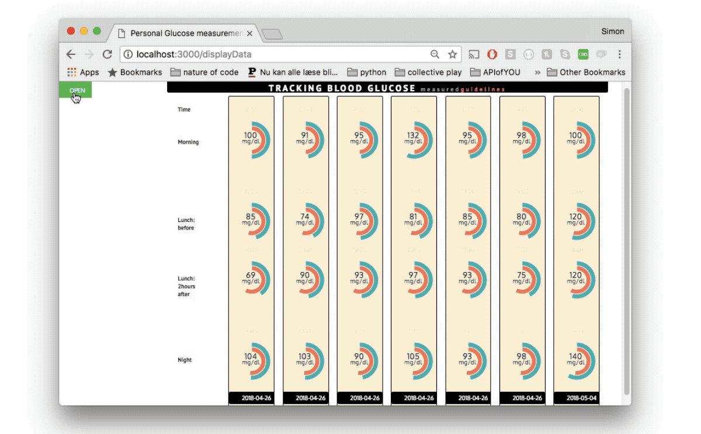

<h1> Glucose Calendar </h1>

 A data visualization project displaying blood glucose values
     and comparing them to recommended guidelines. Using the button in the
     corner of the display you can add your daily measurements and timepoints
     to the 'calendar' that will dynamically expand to fit the added measurements.
     Pressing submit stores the data in a Database (<a href="https://www.mongodb.com/">MongoDB</a>)
     attached to the <a href="https://www.heroku.com/">Heroku</a> app rendering
     and deploying the program. The charts are doughnut multi charts
     from <a href="https://www.chartjs.org/">chart.js. </a> And everything
     is stitched together using javaScript. 
   

   
   

  The project can be seen <strong><a href="https://datameasuresapiofyou.herokuapp.com/displaydata">here</a></strong>
  (Note: the sketch was built for a bigger display. To get an optimal view, zoom out)

  More information about how the projects was created can be found on my
  website <a href="/2018/04/18/API-of-you.html">here</a> and <a href="/2018/05/03/API-of-you-Final.html">here</a>.

